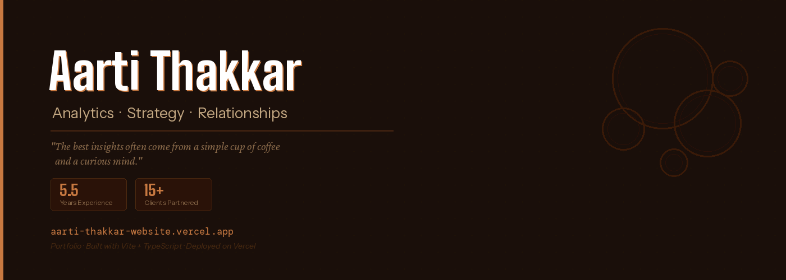

# Aarti Thakkar

> *"The best insights often come from a simple cup of coffee and a curious mind."*

**🔗 Live:** [aarti.fun](https://www.aarti.fun/)

---

## About

I work with organizations to turn complex data into meaningful business decisions — bridging the gap between technical insights and human partnerships.

My approach is built on the belief that **strong relationships are the foundation of any successful analytics initiative**. Whether working with strategic accounts or internal business teams, the goal is always the same: foster understanding, build trust, and drive decisions that are both data-driven and human-centric.

| | |
|---|---|
| **5.5** Years Experience | **15+** Clients Partnered |

---

## What's on This Site

### 💼 Professional Journey
Three pillars of my work:
- **Strategic Account Management** — leading high-value partnerships, aligning analytics with long-term business objectives
- **Analytics-Driven Decision Making** — translating complex datasets into actionable, executive-level insights
- **Stakeholder Collaboration** — bridging technical analytics teams and business leaders for project alignment and delivery

### 👩‍💻 Women in Tech
I care deeply about making analytics and data more accessible and inclusive. This page shares my perspective on encouraging more women to explore, grow, and lead in data-driven industries.

### ☕ Conversations Over Coffee — The Journal
Not essays — conversation starters. Reflections at the intersection of analytics, business, and human relationships:
- *The Human Side of Analytics* — what happens when we approach analytics with empathy first?
- *Why Analytics Needs Better Storytelling* — how can data teams communicate insights more effectively?
- *Customer Relationships in Data-Driven Companies* — how do we keep the human element alive in a world of data streams?

### 📬 Get in Touch
- **Email:** aartithakker1228@gmail.com
- **LinkedIn:** [linkedin.com/in/aarti-thakkar](https://linkedin.com/in/aarti-thakkar/)

## Other Projects

| Project | What | Link |
|---------|------|------|
| DailyRec | Personal podcast feed — Entrepreneurship & AI | [aartii28.github.io/podcast-feed](https://aartii28.github.io/podcast-feed) |

---

*Analytics · Strategy · Relationships*
